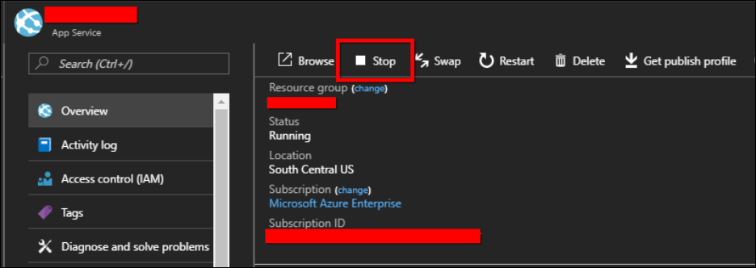
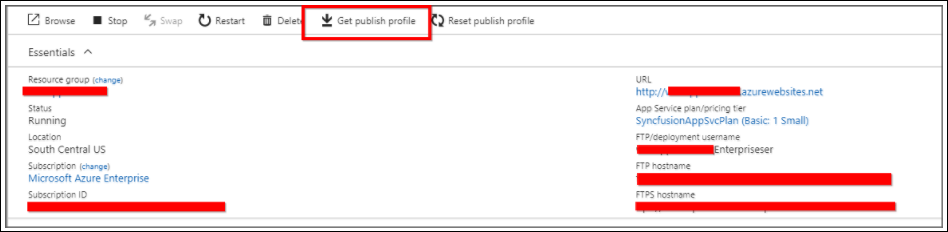
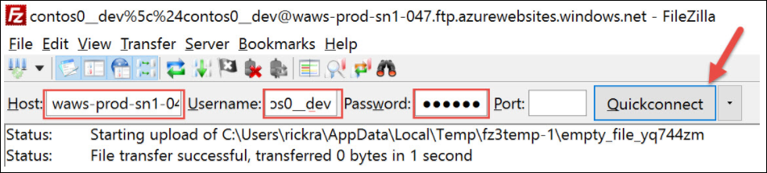
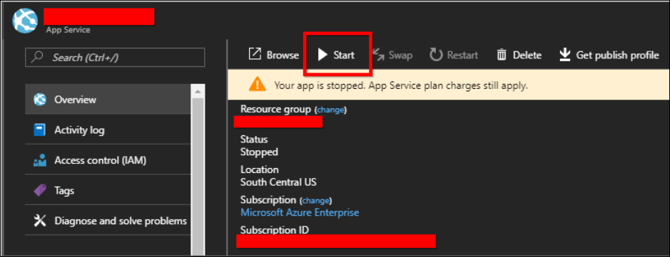

#Adding new localizations for Local Server

Create your own culture texts for the Syncfusion Dashboard Server and add it in the application anytime.

To make Syncfusion Dashboard Server use a different culture perform the following steps:

1. Open [Google Translator Kit](https://translate.google.com/toolkit). Click on Upload button.

    

    It will open a new window to upload the existing culture file en-us. Then click on `Add content to translate` link in the screen.
    
    
 
2. Select `Upload file` option in the dropdown.

    
 
3. Upload [default.po](locale/default.po) file which contains the texts from the Dashboard Server application from `~Installed Drive~\Syncfusion\Dashboard Server\DashboardServer.Web\locale into google translator`.

    For example: `C:\Syncfusion\Dashboard Server\DashboardServer.Web\locale`

4. Make sure that the source language is in English and file name as `messages` as in the below image.

    
    
    Select your desire language in the listed language and click `Next`.
    
5. In the next screen, select `Start Order`, if you need paid service on translation; otherwise select `No, thanks`.

    
 
6. The uploaded file will be listed in home page of translator kit. Click on the file to open it and make any corrections in the translation if needed.

    
 
7. Click on `Complete` on the right-top corner of the page to complete the translation.

    
 
8. Download your translated `messages.po` file.

    
 
9. Create a folder in `~Installed Drive~\Syncfusion\Dashboard Server\DashboardServer.Web\locale` with {language code}-{country code} and paste the downloaded messages.po file inside the newly created folder.

    For example, if you are translating to Italian, create a folder named `it-it` and paste the messages.po like the below.
    
    `C:\Syncfusion\Dashboard Server\DashboardServer.Web\locale\it-it\messages.po`
    
    Newly added language will be listed in language list in Dashboard Server after refreshing the page in the Dashboard Server.
    
    

#Adding new localizations for Azure Web App

Create your own culture texts for the Syncfusion Dashboard Server and add it in the application anytime.

To make Syncfusion Dashboard Server use a different culture perform the following steps:

1. Open [Google Translator Kit](https://translate.google.com/toolkit). Click on Upload button.

    

    It will open a new window to upload the existing culture file en-us. Then click on `Add content to translate` link in the screen.
    
    
 
2. Select `Upload file` option in the dropdown.

    

3. We need [default.po](locale/default.po) file which contains the texts from the Dashboard Server application from the Azure portal.

    To download the `default.po` file, please follow the below steps.

    ### Stop the Dashboard Server App Service

    `Step 1:` Login to Azure portal: https://portal.azure.com.

    `Step 2:` Select App Services in Microsoft Azure Services.

    `Step 3:` Choose the Dashboard Server Azure App Service.

    `Step 4:` In the Overview section, click the Stop.

    

    ### Get existing Azure blob storage details

    Follow the below steps and get the existing Azure blob storage details:

    `Step 1:` Login to Azure portal: https://portal.azure.com.

    `Step 2:` Select App Services in Microsoft Azure Services.

    `Step 3:` Choose the existing Syncfusion Dashboard Server Site and then click the get publish profile.

    

    `Step 4:` Save the <App service name>.PublishSettings file and open it.

    `Step 5:` The file contains 2 <publishProfile> sections for web deploy and FTP.

    `Step 6:` From the FTP <publishProfile> section, copy the following values:
    * publishUrl
    * userName
    * userPWD

    

    `Step 7:` Apply the copied credentials to the host, username, and password fields in the FTP client FileZilla as shown here and click the quickconnect.

    

    `Step 8:` Download the `default.po` file from `/site/wwwroot/locale` folder in the existing Azure App Service through FileZilla.

4. Upload the downloaded file and Make sure that the source language is in English and file name as `messages` as in the below image.

    
    
    Select your desire language in the listed language and click `Next`.
    
5. In the next screen, select `Start Order`, if you need paid service on translation; otherwise select `No, thanks`.

    
 
6. The uploaded file will be listed in home page of translator kit. Click on the file to open it and make any corrections in the translation if needed.

    
 
7. Click on `Complete` on the right-top corner of the page to complete the translation.

    
 
8. Download your translated `messages.po` file.

    

9. Create a folder with {language code}-{country code} and paste the downloaded messages.po file inside the `locale` folder in your local machine.

    Move the entire `locale` folder to azure portal using filezilla.

    For example, if you are translating to Italian, create a folder named it-it and paste the messages.po like below.

    \site\wwwroot\locale\it-it\messages.po

10. In the **Overview** section of your Dashboard Server Azure App Service, click **Start**.

    

    Newly added language will be listed in language list in Dashboard Server after refreshing the page in the Dashboard Server.

    